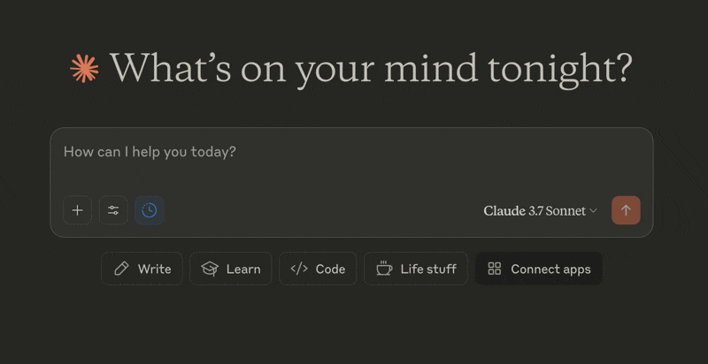

[](https://mseep.ai/app/devin2712-calfire-gis-mcp-server)

# CAL FIRE DINS ArcGIS MCP Server 

A Model Context Protocol (MCP) server that provides fire damage assessment context to AI models for property addresses in the Los Angeles region that were affected by the Eaton and Palisades fires in January 2025. Learn more about MCP in [Model Context Protocol Introduction](https://modelcontextprotocol.io/introduction).

This uses the [MCP TypeScript SDK](https://github.com/modelcontextprotocol/typescript-sdk) with [hono](https://hono.dev/) as the web framework

## Overview

### What is MCP?

The Model Context Protocol (MCP) is a standardized way for AI models to interact with external tools and services. It provides a structured interface that allows AI models to:
- Discover available tools and their capabilities
- Understand tool schemas and required parameters
- Execute tools with proper parameter validation
- Receive structured responses

### CAL FIRE Integration Use Case

This project is an illustrative example that demonstrates how MCP can be used to provide AI models with access to official CAL FIRE damage assessment data. By exposing CAL FIRE's data through an MCP interface, we can enable:

- Direct access to authoritative damage assessment information from CAL FIRE
- Structured querying of fire-affected areas
- Real-time verification of property damage status
- Integration with AI-powered analysis and reporting for subsequent data analysis

Following the January 2025 wildfires in LA, CAL FIRE (California Department of Forestry and Fire Protection) conducted official damage assessments (DINS) and published this data via ArcGIS. For each property that was impacted by the fire, there was an official assessment conducted on how severe the damage was with photographic evidence.

This MCP integration allows AI models to fetch from this official data source and to provide accurate, up-to-date information about fire damage assessments while maintaining data integrity and source verification.

Learn more about the LA Recovery Damage Maps at:
- [LA Recovery: Eaton Fire](https://recovery.lacounty.gov/eaton-fire/)
- [LA Recovery: Palisades Fire](https://recovery.lacounty.gov/palisades-fire/)

## Features

- Geocoding of addresses using ArcGIS Geocoding Service
- Evacuation zone lookup (the maximum evacuation order ever set)
- APN Parcel information retrieval
- Fire DINS damage assessment data retrieval

## Getting Started

### Prerequisites

- bun runtime
- node.js 20 or later
- git

### Installation

1. **Clone and Setup**
   ```bash
   git clone [repository-url]
   cd calfire-gis-mcp-server
   bun install
   ```

2. **Environment Setup** (Optional)
   - Create a `.env` file in the project root
   - Add required environment variables (see [Environment Variables](#environment-variables) section)

3. **Start the Server**
   ```bash
   # Development mode with hot reload
   bun run dev

   # or production mode
   bun run start
   ```

4. **Verify Installation**
   ```bash
   # Check server health
   curl http://localhost:4000/health
   
   # Expected response:
   {
     "status": "ok",
     "service": "calfire-gis-mcp-server",
     "version": "0.1.0",
     "timestamp": "2024-03-21T12:34:56.789Z",
     "uptime": 60
   }
   ```

## Development Tools

### MCP Inspector

The MCP Inspector is a useful tool that can help you test and debug this MCP server.

1. **Ensure your MCP server is running first**
   ```bash
   # Run dev mode
   bun run dev

   # or run production mode
   bun run start
   ```

2. **Start the Inspector**
   ```bash
   bunx @modelcontextprotocol/inspector
   ```

3. You should see this output:
   ```bash
   Starting MCP inspector...
   ⚙️ Proxy server listening on port 6277
   🔍 MCP Inspector is up and running at http://127.0.0.1:6274 🚀
   ```

4. **Open the link from the MCP inspector output**

   The port on your machine may be different than the example shown above

5. Ensure you select the following settings:
   - Transport Type: `Streamable HTTP`
   - URL: `http://localhost:4000/mcp`

   

6. Click **Connect**

7. Once connected, click on **List Tools**
   

8. You should now see the `fetch_fire_damage_assessment_for_address` tool
   

9. Click on the tool name and you will be able to test the `address` input parameter 
   

10. Enter a sample address like `"730 E Altadena Dr Altadena, CA"` and click **Run Tool**
   

11. This will trigger the Tool handler logic and return the resulting payload with the damage data for this address
   

### Claude Desktop Integration

With your MCP server running locally, you can connect it to Claude Desktop to test the integration with an LLM. This requires configuring `claude_desktop_config.json` and using `npx mcp-remote` as a bridge between Claude Desktop and your MCP server.

1. **Download Claude Desktop** at https://claude.ai/download

2. **Locate the Claude Desktop Config Directory**
   - macOS: `~/Library/Application Support/Claude/`
   - Windows: `%APPDATA%\Claude\`
   - Linux: `~/.config/Claude/`

3. **Configure Claude Desktop**

   Create or edit `claude_desktop_config.json`:
   ```json
   {
       "mcpServers": {
           "calfire-gis-mcp-server": {
               "command": "npx",
               "args": [
                   "mcp-remote",
                   "http://127.0.0.1:4000/mcp"
               ]
           }
       }
   }
   ```

> **Note:** We need to use `npx mcp-remote` instead of pointing to the server build directly because Claude Desktop currently supports only `stdio` local transport whereas we are using Streamable HTTP. See more in [MCP Base Protocol: Transports](https://modelcontextprotocol.io/specification/2025-03-26/basic/transports).

4. **Restart your Claude Desktop App** if you have it running

5. **Verify Claude Desktop MCP status**

   You can verify that Claude Desktop has successfully connected to your MCP server by opening the Settings window (`⌘ ,`)

   

6. **Test your MCP server with queries related to the LA Wildfire DINS data**

    You can ask questions like: *What was the official CAL FIRE DINS damage assessment for 730 E Altadena Dr Altadena, CA?*

    

7. **Allow Claude to use an external integration**

    If Claude detects that a registered tool (like the one we have here) could be useful to answer this query, it will invoke the MCP server you have running locally and ask you for permission to use it.

    

8. **Review results!**

   Claude will show its work, calling the `fetch_fire_damage_assessment_for_address` tool  and return a summary of the official damage assessment for the address.

    

## Environment Variables

- `PORT`: Server port (default: 4000)
- `LOG_LEVEL`: Logging level (default: 'info')

## Project Structure

```
src/
  ├── mcp/          # MCP tool definitions
  ├── services/     # Business logic services
  ├── types/        # TypeScript types and Zod schemas
  ├── utils/        # Utility functions
  └── index.ts      # Main server file
```

## Deployment

### AWS Lambda Deployment

The application is deployed as a serverless application using AWS SAM with the following key components:

- **Lambda Function**: Node.js 20.x runtime with 256MB memory
- **API Gateway**: Two endpoints (`/mcp` POST, `/health` GET)
- **Deployment Pipeline**: GitHub Actions workflow that:
  - Runs tests and type checks
  - Builds the application
  - Deploys to AWS using SAM CLI

The deployment is automated through GitHub Actions, triggered on pushes to `main` and pull requests.

You can test with the deployed MCP server: 
```bash
curl https://eg9m4imp6d.execute-api.us-east-2.amazonaws.com/prod/health
```

You can also point Claude Desktop to the production endpoint with (`~/Library/Application Support/Claude/claude_desktop_config.json`):
```json
{
    "mcpServers": {
        "calfire-gis-mcp-server": {
            "command": "npx",
            "args": [
                "mcp-remote",
                "https://eg9m4imp6d.execute-api.us-east-2.amazonaws.com/prod/mcp"
            ]
        }
    }
}
```

## Testing

The project uses Bun's built-in test runner. Tests are located in the `tests` directory and follow the pattern `*.test.ts`.

```bash
# Run all tests
bun test

# Run tests in watch mode
bun test --watch

# Run specific test file
bun test tests/server.test.ts
```

The test suite includes:
- `server.test.ts`: Smoke test that the server correctly follows MCP server conventions and can start up successfully.
- `arcgis.service.test.ts`: Integration tests with the remote ArcGIS servers to test known addresses with different variations of damage data.

## License

MIT
